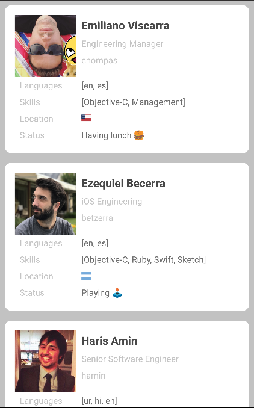

Currency CLIENT
======

A sample Android app which showcases common open source libraries.
The App tries to use a clean OOP structure that's focused on tests.

This project doesn't contains any comments because it tries to be self-commented, this approach 
encourages that the code is the documentation and it requires to be updated as it evolves.

Screenshots
---------

    

Libraries
---------

 * Dagger
 * ButterKnife
 * Retrofit
 * Auto-Parcel
 * Moshi
 * RxJava 2
 * Espresso
 * JUnit
 * Mockito
 * MockWebServer

License
-------

    Copyright 2016 Cristian Gómez

    Licensed under the Apache License, Version 2.0 (the "License");
    you may not use this file except in compliance with the License.
    You may obtain a copy of the License at

       http://www.apache.org/licenses/LICENSE-2.0

    Unless required by applicable law or agreed to in writing, software
    distributed under the License is distributed on an "AS IS" BASIS,
    WITHOUT WARRANTIES OR CONDITIONS OF ANY KIND, either express or implied.
    See the License for the specific language governing permissions and
    limitations under the License.